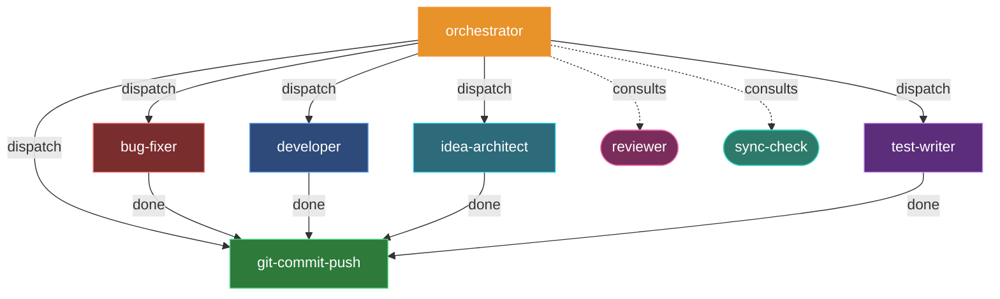

# Agent workflow — Hephaestus

This diagram shows the rendered agent set and their typical dispatch relationships.
Node fill colors come from each agent's `color:` frontmatter (ADR 0006 palette) so multi-agent runs
are visually distinguishable. Executors are rectangular; planners are stadium-shaped; the orchestrator
is the dispatch hub.

> Generated by Hephaestus. Re-run `hephaestus init` to update after changing the agent set.
